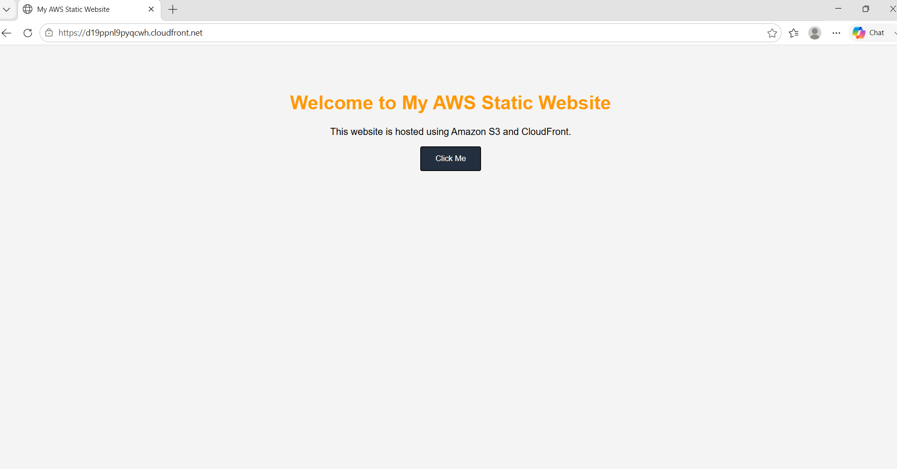
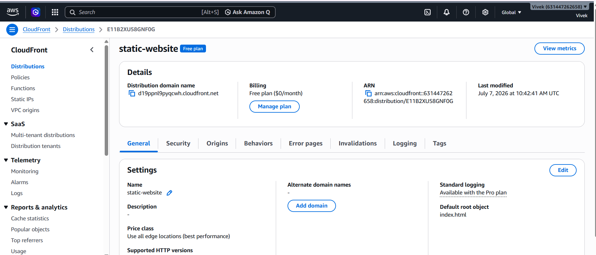
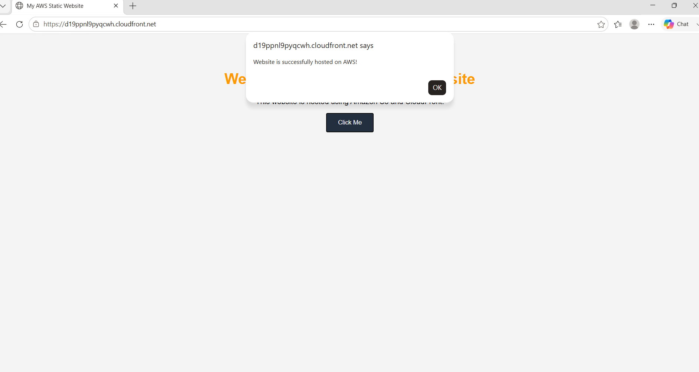
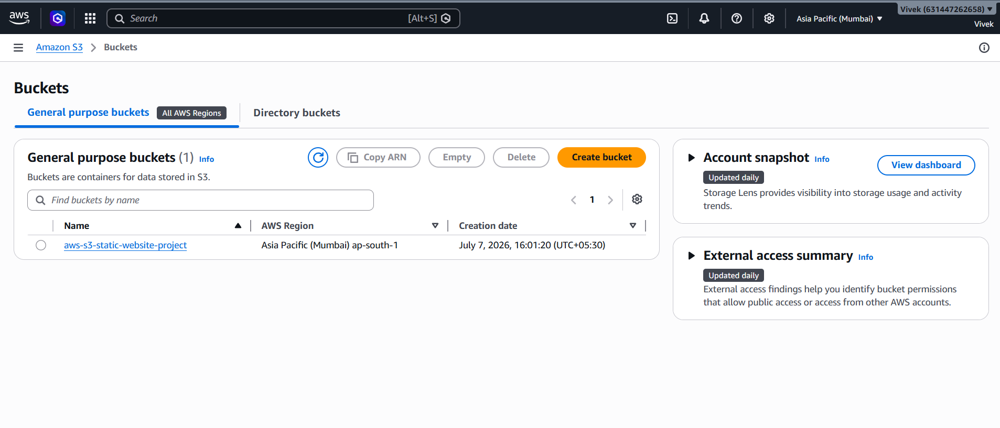
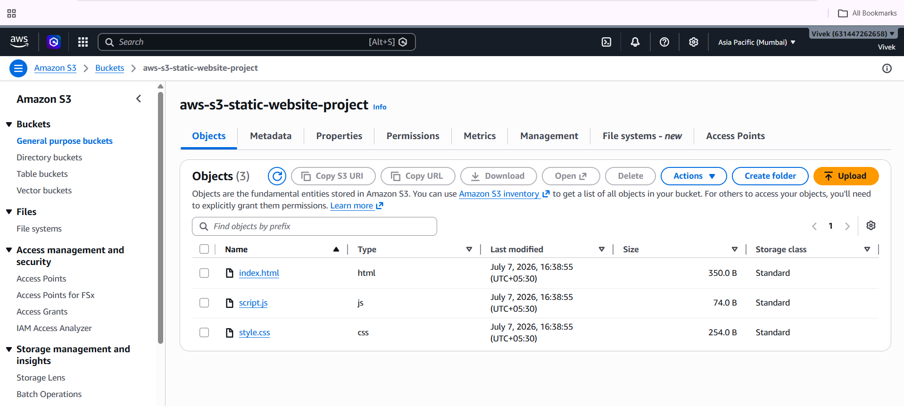

# AWS Static Website Hosting with Amazon S3 & CloudFront

## Project Overview

This project demonstrates how to host a secure static website using **Amazon S3** and deliver content globally using **Amazon CloudFront**. The website is deployed using AWS best practices by keeping the S3 bucket private and allowing access only through CloudFront using **Origin Access Control (OAC)**.

---

## AWS Services Used

- Amazon S3
- Amazon CloudFront
- Origin Access Control (OAC)
- IAM
- S3 Bucket Policy

---

## Technologies Used

- HTML5
- CSS3
- JavaScript
- AWS Management Console

---

## Features

- Static website hosted on Amazon S3
- Content delivery using Amazon CloudFront
- HTTPS support
- Secure private S3 bucket with Origin Access Control (OAC)
- Responsive web page
- JavaScript interaction

---

## Project Architecture

```
                 Internet
                     │
                     ▼
          Amazon CloudFront
                     │
       Origin Access Control (OAC)
                     │
                     ▼
             Amazon S3 Bucket
                     │
        index.html | style.css | script.js
```

---

## Project Structure

```
aws-s3-static-website-project/
│
├── index.html
├── style.css
├── script.js
├── Screenshots/
│   ├── homepage.png
│   ├── cloudfront.png
│   ├── cloudfront-url.png
│   ├── s3-bucket.png
│   └── s3-objects.png
└── README.md
```

---

## Screenshots

### Website



### CloudFront Distribution



### CloudFront URL



### Amazon S3 Bucket



### S3 Objects



---

## Deployment Steps

1. Create an Amazon S3 bucket.
2. Upload website files (`index.html`, `style.css`, `script.js`).
3. Create a CloudFront distribution.
4. Configure Origin Access Control (OAC).
5. Attach the generated bucket policy.
6. Set `index.html` as the Default Root Object.
7. Create a CloudFront invalidation.
8. Access the website using the CloudFront domain.

---

## Challenges Faced

- Fixed **Access Denied** errors caused by incorrect object paths.
- Configured Origin Access Control (OAC) correctly.
- Updated S3 bucket policy to allow CloudFront access.
- Learned CloudFront caching and invalidation.

---

## Learning Outcomes

- Amazon S3
- Amazon CloudFront
- Origin Access Control (OAC)
- IAM
- S3 Bucket Policies
- Static Website Hosting
- AWS Security Best Practices
- CDN Concepts

---

## Author

**Vivek C Raj**

GitHub: https://github.com/vivek65666

LinkedIn: https://www.linkedin.com/in/vivek-c-raj
